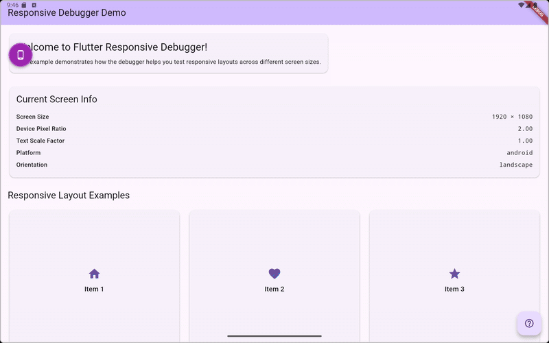

# Flutter Responsive Debugger

[](https://pub.dev/packages/flutter_responsive_debugger)
[](https://github.com/wajahatiqbal22/flutter_responsive_debugger)
[](https://github.com/wajahatiqbal22/flutter_responsive_debugger)



A powerful, professional-grade Flutter package that provides an interactive overlay for testing app responsiveness across different devices, orientations, font scales, and more - all without rebuilding or switching emulators.

## ✨ Features

### 🎯 **Professional UI Components**

- **Draggable Debug Toggle**: Floating button that can be positioned anywhere on screen
- **Organized Control Panels**: Clean, categorized interface with proper visual hierarchy
- **Enum-Driven Architecture**: Type-safe, maintainable code structure

### 📱 **Comprehensive Device Testing**

- **Complete Device Dropdown**: Access all 15+ predefined devices organized by category
- **Device Categories**: Phones 📱, Tablets 📱, Desktops 🖥️, Custom ⚙️
- **Device Information**: Real-time display of dimensions and pixel density
- **Popular Devices**: iPhone 13/14, Pixel 7, iPad 10th Gen, MacBook Pro, and more

### 🎛️ **Advanced Controls**

- **Orientation Toggle**: Seamless portrait/landscape switching with visual indicators
- **Font Scale Control**: Preset chips (Small, Normal, Large, Extra Large, Huge, Accessibility) + custom slider (50%-300%)
- **Visual Debug Options**: Layout bounds overlay, safe area simulation with toggle switches
- **Platform Override**: Test iOS, Android, macOS, Windows, Linux, and Web behaviors
- **Real-time Updates**: All changes apply instantly without app restart

### 🛡️ **Developer Experience**

- **Debug Mode Only**: Automatically disabled in release builds for production safety
- **Cross-Platform**: Works on Android, iOS, Web, Windows, macOS, and Linux
- **Memory Efficient**: Minimal performance impact on your app
- **Easy Integration**: Single widget wrapper - no complex setup required
- **Professional Design**: Beautiful, non-intrusive interface that complements your app
- **Layout Bounds Visualization**: Real-time red border overlay to debug widget boundaries

## 🚀 Getting Started

### Installation

Add this to your package's `pubspec.yaml` file:

```yaml
dependencies:
  flutter_responsive_debugger: ^1.0.3
```

Then run:

```bash
flutter pub get
```

### Basic Usage

Wrap your app with `ResponsiveDebugger`:

```dart
import 'package:flutter/foundation.dart';
import 'package:flutter/material.dart';
import 'package:flutter_responsive_debugger/flutter_responsive_debugger.dart';

void main() {
  runApp(
    ResponsiveDebugger(
      enabled: kDebugMode, // Only enable in debug mode
      child: MyApp(),
    ),
  );
}

class MyApp extends StatelessWidget {
  @override
  Widget build(BuildContext context) {
    return MaterialApp(
      title: 'My App',
      home: MyHomePage(),
    );
  }
}
```

### How to Use

1. **Look for the floating blue button** (📱) on your screen
2. **Tap it** to open the responsive debugger panel
3. **Select a device preset** or enter custom dimensions
4. **Try different orientations** and font scales
5. **Enable layout bounds** to see widget boundaries
6. **Test platform-specific behaviors** with platform override

## 📱 Supported Devices

### Phones

- iPhone SE (3rd gen) - 375×667
- iPhone 13/14 - 390×844
- iPhone 13/14 Pro Max - 428×926
- Pixel 7 - 412×915
- Pixel 7 Pro - 412×892
- Samsung Galaxy S23 - 384×854

### Tablets

- iPad (10th gen) - 820×1180
- iPad Pro 11" - 834×1194
- iPad Pro 12.9" - 1024×1366
- Pixel Tablet - 1600×2560

### Desktop

- MacBook Air 13" - 1440×900
- MacBook Pro 14" - 1512×982
- Desktop 1080p - 1920×1080
- Desktop 1440p - 2560×1440

## 🎛️ Controls

### Device Simulation

- **Device Presets**: Choose from predefined device configurations
- **Custom Size**: Enter specific width and height dimensions
- **Orientation**: Toggle between portrait and landscape

### Typography & Accessibility

- **Font Scale**: Adjust from 0.5x to 3.0x with preset options:
  - Small (0.8x)
  - Normal (1.0x)
  - Large (1.2x)
  - Extra Large (1.4x)
  - Huge (1.6x)
  - Accessibility (2.0x)

### Visual Debugging

- **Layout Bounds**: Show red borders around all widgets
- **Safe Area**: Simulate device-specific safe areas (notches, etc.)
- **Zoom Level**: Scale the entire UI from 0.5x to 2.0x

### Platform Testing

- **Platform Override**: Test platform-specific code paths
  - Android
  - iOS
  - macOS
  - Windows
  - Linux
  - Web

## 🔧 Advanced Usage

### Programmatic Control

You can control the debugger programmatically using the `DebuggerController`:

```dart
import 'package:provider/provider.dart';
import 'package:flutter_responsive_debugger/flutter_responsive_debugger.dart';

// Access the controller
final controller = context.read<DebuggerController>();

// Set a specific device
controller.setDevice(Devices.findByName('iPhone 13/14'));

// Change orientation
controller.setOrientation(DebugOrientation.landscape);

// Set font scale
controller.setFontScale(1.5);

// Toggle layout bounds
controller.toggleLayoutBounds();

// Reset all settings
controller.reset();
```

### Export/Import Configurations

```dart
// Export current configuration
final config = controller.toJson();

// Save to preferences, file, etc.
prefs.setString('debug_config', jsonEncode(config));

// Later, restore configuration
final savedConfig = jsonDecode(prefs.getString('debug_config') ?? '{}');
controller.fromJson(savedConfig);
```

### Custom Device Configurations

```dart
final customDevice = DeviceConfig(
  name: 'My Custom Device',
  size: Size(400, 700),
  pixelRatio: 2.0,
  safeArea: EdgeInsets.only(top: 30, bottom: 20),
  category: DeviceCategory.phone,
  platform: DebugPlatform.android,
);

controller.setDevice(customDevice);
```

## 🧪 Testing

The package includes comprehensive tests:

```bash
# Run all tests
flutter test

# Run with coverage
flutter test --coverage
```

## 🛡️ Safety

The debugger automatically disables itself in release builds:

```dart
// Safe - will not show in production
ResponsiveDebugger(
  enabled: kDebugMode, // This is false in release builds
  child: MyApp(),
)

// You can also explicitly disable it
ResponsiveDebugger(
  enabled: false,
  child: MyApp(),
)
```

## 🎨 Customization

### Responsive Extensions

The package includes helpful extensions for responsive design:

```dart
import 'package:flutter_responsive_debugger/flutter_responsive_debugger.dart';

// Check device type
if (context.isPhone) {
  // Phone-specific layout
} else if (context.isTablet) {
  // Tablet-specific layout
}

// Responsive values
final padding = context.responsive<double>(
  xs: 8.0,
  sm: 12.0,
  md: 16.0,
  lg: 24.0,
  fallback: 16.0,
);

// Show widgets conditionally
Text('Desktop only').showOn(desktop: true, phone: false, tablet: false)
```

### Screen Utilities

```dart
import 'package:flutter_responsive_debugger/flutter_responsive_debugger.dart';

// Get current breakpoint
final breakpoint = context.breakpoint; // 'xs', 'sm', 'md', 'lg', 'xl', 'xxl'

// Check breakpoint
if (context.matchesBreakpoint('lg')) {
  // Large screen layout
}

// Get recommended padding
final padding = context.recommendedPadding;
```

## 📖 Examples

Check out the [example](example/) directory for a complete demo app showing all features.

## 🤝 Contributing

Contributions are welcome! Please feel free to submit a Pull Request.

1. Fork the repository
2. Create your feature branch (`git checkout -b feature/AmazingFeature`)
3. Commit your changes (`git commit -m 'Add some AmazingFeature'`)
4. Push to the branch (`git push origin feature/AmazingFeature`)
5. Open a Pull Request

## 📝 License

This project is licensed under the MIT License - see the [LICENSE](LICENSE) file for details.

## 🙏 Acknowledgments

- Inspired by browser developer tools and responsive design testing needs
- Built with ❤️ for the Flutter community

## 📚 Additional Resources

- [Flutter Responsive Design Guide](https://docs.flutter.dev/development/ui/layout/responsive)
- [Material Design Breakpoints](https://material.io/design/layout/responsive-layout-grid.html)
- [Flutter Testing Guide](https://docs.flutter.dev/testing)
